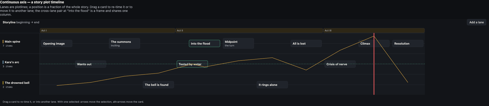
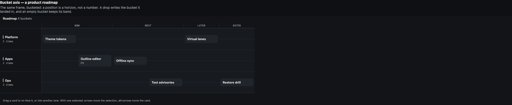

# react-lane-timeline

**Items positioned along an axis, inside lanes.** A swimlane timeline for React
that handles both kinds of "when" — a continuous fraction *and* a named bucket —
because those are structurally different problems and most libraries only solve
one.



```sh
npm install react-lane-timeline
```

---

## The problem

Every lanes-and-sequence UI looks the same until you ask what "position" means.

A **plot timeline** positions a scene at a fraction of the whole story: `0.34`.
Moving it means recomputing a number, and the item between its new neighbours
slides. A **roadmap** positions a card in `now | next | later`. Moving it means
naming a different bucket; there is no number, and "between now and next" is not
a place.

Those are not the same data model wearing different labels. So libraries pick
one — and the other app writes its own. This package takes either:

```ts
{ kind: 'continuous', at: 0.34 }   // a fraction of the axis
{ kind: 'bucket', key: 'now' }     // a named band
```

`buildModel` resolves both into a single axis fraction, so every layout
calculation downstream sees one number and the component has one code path.



---

## What you get

| | |
|---|---|
| **Both axis kinds** | Continuous `0..1`, or named buckets. One component, one data contract. |
| **Rank-packed layout** | Columns take a fixed slot in position order, so 79 items are not 13,000px of mostly-empty scroll. Order still comes from the real position. |
| **Frames** | Items sharing a `groupId` across two or more lanes at one position share a column — a cross-lane coincidence, drawn as one thing. |
| **Collisions** | Two items in the *same* lane at the same position is a defect, not a frame. They are reported separately so your app can show it. |
| **Drag and keyboard** | Raw pointer events, no DnD dependency. Everything reachable by drag is reachable by arrow keys; `alt`+arrows move the item, plain arrows move the selection. |
| **Tension overlay** | An optional polyline over the lane beds, with the peak marked. |
| **Themeable** | 30-odd `--tl-*` custom properties. No CSS-in-JS, no theme provider, no opinion about your state library. |
| **A pure model** | `react-lane-timeline/model` imports no React. A server route can compute a layout. |

**One peer dependency: React.** That is the entire runtime dependency list.

---

## Use it

```tsx
import { Timeline, type TimelineData, type TimelineMove } from 'react-lane-timeline'
import 'react-lane-timeline/timeline.css'
import 'react-lane-timeline/adapters/default.css'   // or map your own palette

const data: TimelineData = {
  axis: { kind: 'continuous' },
  lanes: [
    { id: 'main', label: 'Main spine' },
    { id: 'kara', label: "Kara's arc", color: '#7fb3d5' },
  ],
  groups: [{ id: 'act1', label: 'Act I', span: [0, 0.3] }],
  items: [
    { id: 'p1', laneId: 'main', title: 'Opening image', position: { kind: 'continuous', at: 0.04 } },
    { id: 'p3', laneId: 'main', title: 'Into the flood', position: { kind: 'continuous', at: 0.34 }, groupId: 'flood' },
    { id: 'k2', laneId: 'kara', title: 'Tested by water', position: { kind: 'continuous', at: 0.34 }, groupId: 'flood' },
  ],
}

function Board() {
  const [board, setBoard] = useState(data)

  return (
    <Timeline
      data={board}
      tensionOverlay
      onMove={(itemId, move: TimelineMove) =>
        setBoard((d) => ({
          ...d,
          items: d.items.map((i) =>
            i.id === itemId ? { ...i, laneId: move.laneId, position: move.position } : i,
          ),
        }))
      }
    />
  )
}
```

**The host owns the data.** Every gesture calls `onMove` and nothing else — the
component keeps no copy of your items. A host that rejects a move simply does
not re-render one, and an optimistic host writes immediately. Neither needs a
prop to opt in.

---

## The data contract

### Axis

| Axis | Declared as | An item's position | Good for |
|---|---|---|---|
| Continuous | `{ kind: 'continuous' }` | `{ kind: 'continuous', at: 0..1 }` | a plot timeline; anything ordered by a real number (a date, a duration, a score) |
| Buckets | `{ kind: 'buckets', buckets: [{ key, label }] }` | `{ kind: 'bucket', key }` | a roadmap; any set of named horizons |

An item whose position kind does not match the axis resolves to the axis start
rather than throwing — a half-migrated backend renders, it does not blank the
page.

### Frames vs. collisions

This is the one rule worth knowing before you model your data.

- Items sharing a `groupId` **in two or more lanes at the same position** are a
  **frame**: one column, drawn together. A scene that two characters are both in.
- Two items **in the same lane at the same position** are a **collision**: a
  defect. `collisions()` returns them and the component marks them, so you can
  decide whether to resolve or allow it.

They come back as separate outputs rather than one "overlaps" list, because they
mean opposite things: one is the point of the view, the other is a bug in the
data.

### Groups

A `Group` draws a band across the axis. With an explicit `span` it covers that
range — acts, quarters, phases. **Without** a `span` it hugs the columns of the
items whose `groupId` is the group's id, so a frame gets a band around its own
column for free.

---

## Theming

`timeline.css` resolves each public `--tl-*` hook **once** into a private
`--_tl-*` role and paints only from the roles. That indirection is the whole
theming story, and it is enforced by a contract test that holds the token list
and the stylesheet to each other in both directions — neither can drift without
a test going red.

To theme it, write an adapter: a file of custom properties and nothing else,
mapping *your* design system's names **into** `--tl-*`.

```css
/* my-app.css — map inward, never outward */
:root {
  --tl-bg: var(--panel, #121418);
  --tl-bg-lane: var(--panel-sunken, #171a1f);
  --tl-accent: var(--brand, #4f9ae8);
}
```

Map inward and a live theme switch is followed for free, because every `var()`
is substituted at use. Give every host token a literal fallback and a build
missing one still renders a timeline instead of an unstyled box.

The bundled `adapters/default.css` is the package's own palette — a calm dark
board that switches to light values under `data-tl-scheme="light"`.

### What the stylesheet will not do to your page

Enforced by `contract.test.ts`, not by good intentions:

- Every selector is scoped to a `.tl-*` class. No rule reaches your page.
- `position` is only ever `relative`, `absolute` or `sticky` — never `fixed`.
- `z-index` stays single-digit and local to the component's own stacking context.
- Nothing is measured in viewport units. **The host owns the size of the box.**
- Offsets only ever apply inside an already-positioned `.tl-*` internal.

---

## Accessibility

Every move available to a pointer is available to the keyboard:

| Key | Does |
|---|---|
| <kbd>←</kbd> <kbd>→</kbd> <kbd>↑</kbd> <kbd>↓</kbd> | move the selection |
| <kbd>alt</kbd> + <kbd>←</kbd> <kbd>→</kbd> | re-time the item (or step one bucket) |
| <kbd>alt</kbd> + <kbd>↑</kbd> <kbd>↓</kbd> | move the item to another lane |

Lane headers are editable in place when you pass `onLaneRename`. `readOnly`
disables every move but keeps selection working, so a read-only view is still
navigable rather than inert.

---

## API

### `<Timeline>`

| Prop | Type | Notes |
|---|---|---|
| `data` | `TimelineData` | **required** — `{ axis, lanes, items, groups? }` |
| `onMove` | `(itemId, move) => void` | a drag or alt+arrow landed somewhere new |
| `onSelect` | `(itemId \| null) => void` | |
| `onLaneAdd` | `() => void` | given ⇒ the bar offers "Add a lane" |
| `onLaneRename` | `(laneId, label) => void` | given ⇒ lane labels are editable in place |
| `renderItem` | `(args) => ReactNode` | `args` carries `{ item, selected, collides }` |
| `renderLaneHeader` | `(args) => ReactNode` | `args` carries `{ lane, itemCount, collisionCount }` |
| `tensionOverlay` | `boolean` | draw the tension polyline |
| `readOnly` | `boolean` | no moves; selection still works |
| `layout` | `LayoutOptions` | override gap, gutter, lane height |
| `selectedId` | `string \| null` | controlled selection; omit to let the component hold it |
| `title` · `emptyTitle` · `emptyHint` · `className` | `string` | |

### The model — `react-lane-timeline/model`

React-free, DOM-free, individually unit-tested:

`buildModel` · `computeLayout` · `frames` · `collisions` · `resolveAt` ·
`bucketAt` · `dropPosition` · `insertionPosition` · `tensionCurve`

```ts
import { buildModel, computeLayout } from 'react-lane-timeline/model'

const model = buildModel(data)          // positions resolved, frames found
const layout = computeLayout(model)     // rank-packed columns
```

---

## Develop

```sh
pnpm install
pnpm dev        # the demo at http://localhost:5173 — both axis kinds, in-memory
pnpm build
pnpm test       # 107 tests
pnpm typecheck
```

`examples/demo` is a real consumer, not a storybook: the state lives in the page
exactly as a host's would, and every drag writes through `onMove`. If a change
breaks the contract, the demo stops working in the same way your app would.

---

## Design notes

[`docs/ORIGIN.md`](docs/ORIGIN.md) — why this accepts two kinds of axis instead
of picking one, and why the layout is rank-packed rather than distance-scaled.

---

## License

MIT © David Hook
